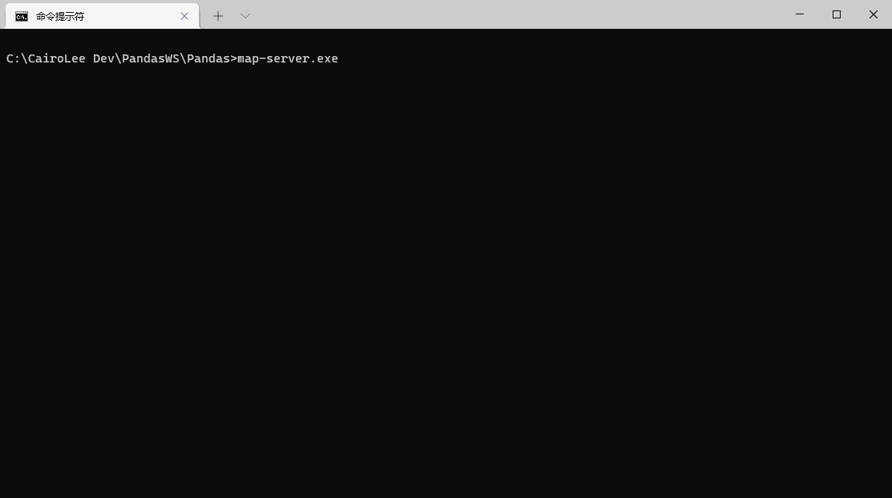

<h1 align="center">熊猫模拟器</h1>

  基于 <code>rAthena</code> 构建的开源跨平台中文仙境传说模拟器，帮助您自由的构建世界

 

  <!-- Clang Status -->
  
  <!-- GCC Status -->
  
  <!-- MSBuild Status -->
  
  <!-- GitHub contributors -->
  
  <!-- GitHub license -->
  
  <!-- Discord Online -->
  

  <h3>
    <a href="https://pandas.ws" target="_blank">
      官网
    </a>
     | 
    <a href="https://docs.pandas.ws" target="_blank">
      使用手册
    </a>
     | 
    <a href="https://github.com/PandasWS/Pandas/releases">
      下载
    </a>
     | 
    <a href="https://github.com/PandasWS/Pandas/graphs/contributors">
      贡献者
    </a>
     | 
    <a href="https://discord.gg/9bEfrPPruj" target="_blank">
      Discord
    </a>
  </h3>

  
  如果您觉得此项目能够给您带来帮助，请点击项目主页右上角的 ★Star 给它一颗星星
   
  Craft with ❤︎ by
  <a href="https://github.com/CairoLee">CairoLee</a> and
  <a href="https://github.com/PandasWS/Pandas/graphs/contributors">
    Contributors
  </a>
  

## 神奇的小目录

-   [背景](#背景)
-   [熊猫专业版](#熊猫专业版)
-   [模拟器特色功能](#模拟器特色功能)
-   [编译说明](#编译说明)
-   [常见问题](#常见问题)
-   [加入爱好者社区](#加入爱好者社区)
-   [维护者](#维护者)
-   [如何作出贡献](#如何作出贡献)
-   [许可协议](#许可协议)

## 背景

仙境传说是一款非常经典的游戏，伴随着绝大多数玩家们的成长。感谢这款游戏，我们在茫茫人海中
认识了彼此，虽然我们不在同一个城市，但都彼此各自成长。从商业上看她可能不是一款最好的游戏，
但是情感上她已经成为了我们记忆中的一部分。

对这款游戏的热爱使得全世界的爱好者们为她打造出了一系列的模拟器，其中以 Athena 系列模拟器
尤为健壮，还在维护的 Athena 系列模拟器中又以 rAthena 最为活跃。

但 rAthena 是一个国际开源项目，对中文并不是特别友好。再加上其定位非常明确，即：只做尽可
能接近官方的模拟器 ( 意味着其改动依据都将以 kRO 为准；而非官方的改动不符合该原则 ) 。

因此我们将站在 rAthena 的巨人肩膀上二次开发了 Pandas 模拟器 ( 熊猫模拟器 ) ，我们的定位
也非常朴素和简单：对中文用户友好的仙境传说模拟器。

## 模拟器特色功能

主要是与 rAthena 模拟器相比的差异化功能，这些功能可能其他闭源模拟器已经实现，但在熊猫里面
相关代码是开源的，方便您学习或者随意修改。欢迎您阅读熊猫模拟器的 [功能配置文件]
来了解我们做过的所有功能改动。甚至通过此文件，您也可以直接关闭熊猫模拟器对某些功能的更改，
使之恢复到与 rAthena 行为一致。

### 值得一提的功能

-   __终端信息汉化__ —— 汉化绝大部分终端提示的文本信息，兼容简体和繁体中文
-   __支持 UTF8 数据文件__ —— 支持 UTF8 (with BOM) 文件的读取，并自动转换成适用编码
-   __变态服拓展包__ —— 解锁角色的素质上限， 可以给角色几百万的 STR 等六维素质值
-   __单位光环系统__ —— 可以为任意游戏单位设置光环特效，可将多个视觉效果组合成光环
-   __简易挂机机制__ —— 支持：离开 / 挂机两种模式， 挂机单位可被 Unit 系列脚本指令控制
-   __护身符道具__ —— 能够将道具设置为护身符，放在背包即可生效
-   __效果脚本拓展__ —— 使效果脚本 ( Bonus Script ) 拥有唯一编号， 可被单独移除
-   __MySQL 8.0 支持__ —— 能够支持 MySQL 8.0 及更新的数据库而不会出现连接错误
-   __崩溃转储生成__ —— 程序崩溃时能自动生成并上报转储文件，帮助研发人员解决问题

### 指令集和事件拓展

在 rAthena 原来的指令集和事件基础上我们拓展了更多的小玩意，使脚本作者们能够充分发挥自己
的想象力，给玩家带来有趣和好玩的游戏体验。具体详情请见对应的说明文档：

-   [管理指令 ( Atcommands )](doc/pandas_atcommands.txt)
-   [脚本指令 ( Script Commands )](doc/pandas_script_commands.txt)
-   [事件标签 ( NPC Event Label )](doc/pandas_events.txt)
-   [地图标记 ( Mapflags )](doc/pandas_mapflags.txt)
-   [效果调整器 ( Bonus )](doc/pandas_bonus.txt)

若您有拓展需求或者想法，请您 [反馈] 给我们，或者 [加入爱好者社区](#加入爱好者社区) 进行反馈。

## 编译说明

查阅如何在 Windows 和 Unix 环境下编译熊猫模拟器, 请移步阅读 [熊猫使用手册] 。

## 常见问题

### 请问有一键开服端吗？

很遗憾，熊猫模拟器当前并没有官方的一键开服套件。熊猫模拟器当前面向的主要用户，并非是一窍
不通的萌新玩家，毕竟搞懂一个开源项目需要大量的背景知识。我们亦希望通过早期维持使用难度
以便召集一群知识覆盖面相当，有经验的使用者。为以后熊猫模拟器的迭代做储备。

### 当前对应仙境传说的哪个 EP 版本？

此问题无法答复，因为模拟器并非官方服务端，我们游戏中的所有功能都是「尾随」官方之后通过一些
爱好者在官服的体验游玩，分析和观察后模拟实现的；官服的每个 EP 版本都是无数小调整组合在
一起的 「集合包」，这些调整中有的模拟起来比较简单而有的非常复杂，这就导致了模拟器实装这些
改动的时间的无法被统一。

玩家若能看到某个模拟器搭设的服务器中，宣传语提到了所谓实装 EP XX.X 资料片，绝大多数都
只是实装了一些关键特征而已。比如：某 EP 版本才拥有的副本，出现在了该服务器中，因此宣传的
时候以：实装 EP XX.X 来吸引玩家罢了！

当然，凡事总有例外：有的爱好者有着自己的追求，在掌握大量的数据和资料的情况下，甚至能够模拟
到玩家几乎无感知，但这必定花费了大量的心血。

### 支持的客户端封包版本是哪个？

截止 `2022 年 08 月 08 日` 熊猫模拟器 `v1.1.15` 版本默认的客户端封包版本是 `20211117`。

若您希望客户端封包使用其他封包版本，例如：`20200409`，那么只需下载源代码后通过修改 
`src/config/packet.hpp` 文件中 `PACKETVER` 的定义，随后重新编译即可。

### 哪里能获取配套客户端？

若您有能力，我们建议您自己整理一套客户端，这才能最好的符合您自己的使用需求。通常所谓的配套
客户端其实通常只是封包版本匹配，能成功进入游戏罢了。但是游戏中还会有无数的道具、魔物、地图，
这些内容必须让它与模拟器服务端中的数据完全匹配才能算真正意义上的配套，但很难。

> 尽管如此：我们将全球各个官服的资源文件进行提取和混合，创建了名为 [LeeClient]
的客户端整合项目，在这个项目中你可以随意切换客户端版本来进行调试。

__此外这套 LeeClient 客户端依然存在很多缺陷：__

-   对繁体中文环境支持不够友好 ( 当前几乎不能使用 )
-   支持从 `20130807` 到 `20180620` 的几个主要客户端封包版本，但不支持 `2020` 年的客户端
-   它是面向 GM 设计的，而不是面向玩家设计的，因此无法轻松分发给玩家使用
-   虽然实现了自动汉化，甚至能自动汉化图片，但是翻译对照表并不完整，很多内容都是韩文乱码

### 有全汉化的官方 NPC 脚本文件吗？

没有！整个模拟器截止 `2021 年 04 月 11 日 ` 有大约 38 万条文本，这是社区十几年无数人的积累。
对这么大量的文本进行汉化和校对不是简单的「懂英文」就搞得定的，特别费时费力！

想找到精校版免费的官方 NPC 脚本，几乎不太可能。如果是在有需求的话，还是建议直接找熟人或者
网上爬其他人汉化好的脚本来用吧。但需要注意的是，由于 NPC 脚本中混合了对话文本和与玩家的
交互逻辑。别人分享的汉化脚本如果全盘接收不加审阅的话，可能会存在刻意预埋的后门，导致服务器
被提权或者被黑。

## 加入爱好者社区

我们的 QQ 交流群的群号码是：`928171346` 若您已安装 [腾讯 QQ] 客户端那么请直接：

此外我们建立了 [Discord] 服务器,  有条件加入的同学欢迎您 [加入 PandasWS 服务器](https://discord.gg/9bEfrPPruj)。

## 维护者

-   [CairoLee] —— 很难被研发忽悠瘸的产品经理 ( AKA: Sola 丶小克 )
-   [Renee] —— 心情好就会忘记回消息的乐天派

## 如何作出贡献

有关如何为熊猫模拟器做出贡献的详细信息，请参见 [作出贡献] 。

感谢已经为熊猫模拟器做出贡献的人们！

## 许可协议

版权所有 © 熊猫模拟器开发团队 - 授权许可协议 [GNU General Public License v3.0](LICENSE)

[下载页面]: https://github.com/PandasWS/Pandas/releases
[功能配置文件]: src/config/pandas.hpp
[反馈]: https://github.com/PandasWS/Pandas/issues/new/choose
[熊猫使用手册]: https://docs.pandas.ws/
[LeeClient]: https://github.com/PandasWS/LeeClient
[腾讯 QQ]: https://im.qq.com
[Discord]: https://discord.com/
[作出贡献]: https://docs.pandas.ws/contributing

[rAthena]: https://github.com/rathena/rathena

[CairoLee]: https://github.com/CairoLee
[Renee]: mailto:rne0430@gmail.com
