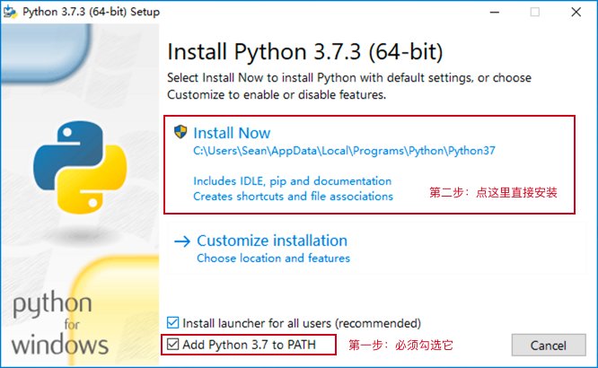
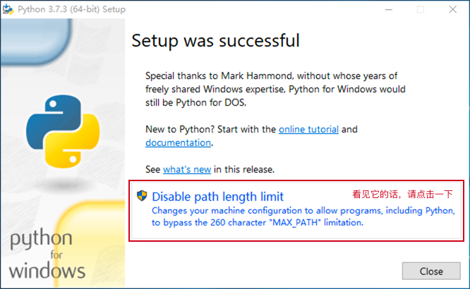
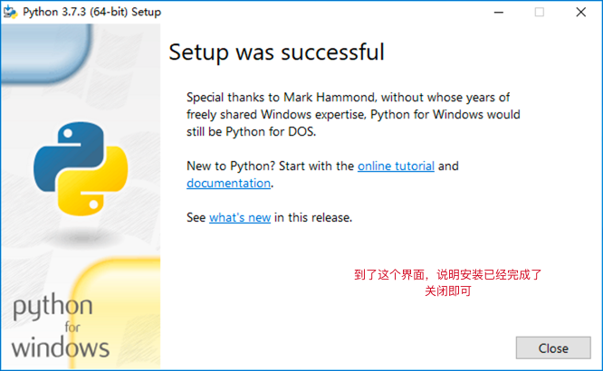
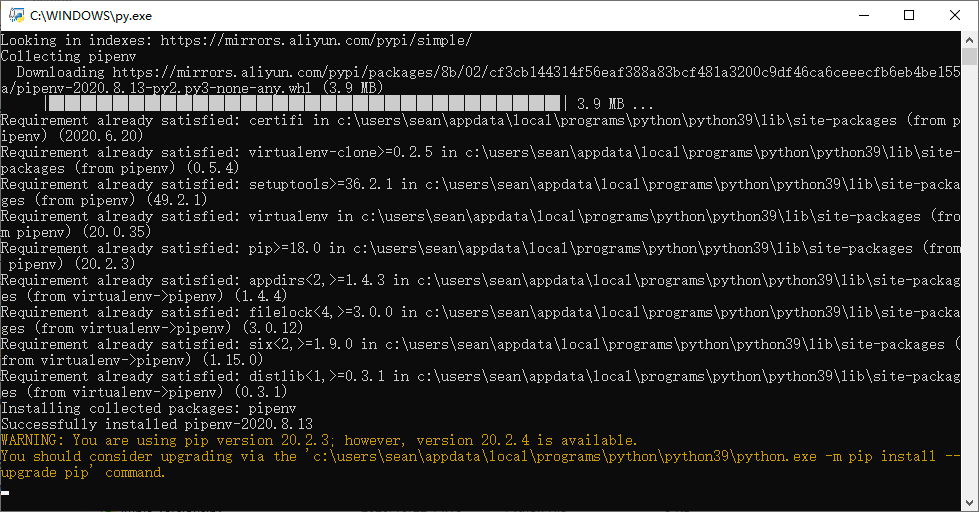
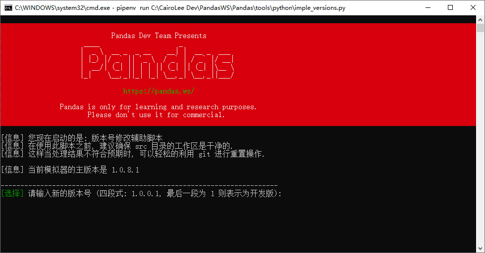

熊猫辅助脚本说明
=============================================

在日常维护 Pandas 的过程中, 有大量重复的工作需要被经常执行, 这些工作通常都有既定的流程或者固定的模式.

为了便于提高工作效率, 我们实现了一些辅助脚本用来进行大量的半自动化工作.

脚本功能简介
--------------------------------------------

- 使用 `create_atcmd.py` 可以轻松的创建一个新的管理员指令
- 使用 `create_scriptcmd.py` 可以轻松的创建一个新的脚本指令
- 使用 `create_battlecfg.py` 可以轻松的创建一个新的战斗配置选项
- 使用 `create_mapflag.py` 可以轻松的创建一个新的地图标记
- 使用 `create_npcevent.py` 可以轻松的创建一个新的 NPC 事件

- 使用 `imple_src2utf8.py` 可以将 src 中的代码全部转换成 UTF8 编码
- 使用 `imple_versions.py` 可以用来快速调整多个工程的版本号
- 使用 `imple_translate.py` 可以根据对照表快速翻译部分 DB 信息
- 使用 `imple_extracter.py` 可以提取源码中的字符来构建翻译数据库

- 使用 `dawn_compile.py` 可以执行发布新版本之前的编译工作
- 使用 `dawn_symstore.py` 可以将 `dawn_compile.py` 生成的符号文件归档
- 使用 `dawn_publish.py` 可以构建发布新版本使用的压缩包 (包括自动汉化)


可预见的未来我们还会陆续的添加各种不同的半自动辅助脚本,

这些脚本使用 Python 3.x 版本进行编写, 你需要安装 Python 系统才能理解这些脚本.

第一步: 下载 Python 3.x
--------------------------------------------

请直接前往 https://www.python.org/downloads/windows/ 下载安装程序.

通常我们优先选用版本号较高的稳定版本(Stable Releases).

- 若您是 64 位系统, 下载 `Windows x86-64 executable installer` 即可.
- 若您是 32 位系统, 下载 `Windows x86 executable installer` 就可以了.

第二步: 安装 Python 3.x
--------------------------------------------

下载完成安装程序后, 直接运行启动它, 在第一个界面中按以下说明进行安装:



若您是第一次安装, 那么安装完成到末尾会有一个选项, 需要您启用它:



最终如果你看到如下图的选项, 那么就说明安装过程已经成功结束了:



第三步: 确认 Python 能正常工作
--------------------------------------------

安装完成之后, 打开一个新的 `终端` 或者 `cmd` 窗口, 输入以下两个指令进行测试.

我们先输入以下指令来测试 python 指令是否可用:

```
python --version
```

如果 python 指令可用, 那么会显示当前安装的 python 版本号. 例如:

```
C:\Users\Sean>python --version
Python 3.7.1
```

接下来我们输入以下指令来测试 pip 指令是否可用:

```
pip --version
```

如果 pip 指令可用, 那么会显示当前安装的 pip 版本号和安装位置. 例如:

```
C:\Users\Sean>pip --version
pip 19.1.1 from c:\users\sean\appdata\local\programs\python\python37\lib\site-packages\pip (python 3.7)
```

第四步: 试试执行某个脚本
--------------------------------------------

当上述步骤全部准备完毕之后, 就可以运行我们的辅助脚本了.

### Windows

直接双击 `tools\python` 目录中某一个你感兴趣的脚本文件 (例如: `imple_versions.py`), 第一次程序会自动安装必要的依赖, 它会自动检查并安装 `pipenv` 且会自动运行 `pipenv install` 来安装或更新虚拟环境:



若有卡顿请稍作等待, 如果程序执行一切顺利, 你就会看到红色的 Pandas 脚本欢迎界面:



关于依赖更新: 程序已经处理好了一切, 现在你什么都不用管, 该更新的时候程序会自动更新.

### Linux

如果您使用 Linux 系统, 那么我们相信您应该有非常丰富的计算机知识.

1. 请使用 `pip install pipenv` 安装 `pipenv`
2. 使用 `cd` 指令切换到 `tools\python` 目录
3. 执行 `pipenv install` 完成虚拟环境的初始化工作

以后若需要运行辅助脚本, 则在 `tools\python` 目录下使用 `pipenv shell` 进入虚拟环境的 Shell 并使用 `python imple_versions.py` 这样的方式来运行脚本即可.

如果您喜欢, 也可以直接使用 `pipenv run imple_versions.py` 来运行脚本. 更多关于 `pipenv` 的使用方法可以查阅官方文档.

关于依赖更新: 若你发现缺少某些库文件或者看到 `Pipfile.lock` 文件有了更新, 可以在 `tools\python` 目录下使用 `pipenv sync` 或者 `pipenv install` 来更新依赖.
